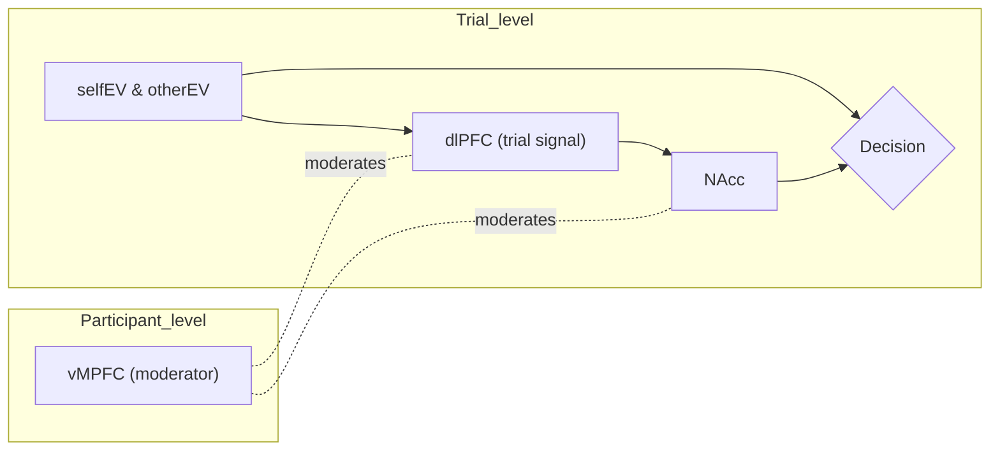

# 🧠 Statistical Modeling of Decision-Making & fMRI

A quick repo for trial-level decision-making with fMRI BOLD signals.  
The pipeline models choices with **hierarchical mixed-effects** and explores a **moderated-mediation** structure via **SEM**.  
This work includes a partially finished paper and accompanying R code.
It was completed while I was a PhD student. If interested in further reading, it's an extension of my masters thesis found [here](https://utoronto.scholaris.ca/server/api/core/bitstreams/746812a9-6f1a-4932-a066-39af145a6d25/content).

> 🎯 **Goal:** Explain how expected values (EVs) and prefrontal signals predict choice, with **NAcc** as a mediator and **vMPFC** as a moderator, accounting for participant/run nesting.

---

## 🔍 TL;DR (what’s in here)

- 🧪 **Behavior:** trial-level **`Decision`** from EVs + neural predictors (e.g., dlPFC / vMPFC), with participants (`ptp`) and runs (`Run`) as grouping factors.  
- 🧩 **Mediator:** **`NAcc`** predicted from the same inputs.  
- 🧱 **SEM layer:** **lavaan** tests (moderated) mediation using centered variables and interaction terms.  
- 📄 **Paper:** the PDF documents the design and rationale.

---

## 🔑 Central finding (plain English)

- ❤️‍🩹 **Prosocial choice via upregulating “Other,” not downregulating “Self.”**  
  Patterns in the models were **more consistent with increased sensitivity to the *other* person’s expected value** (and its impact along the dlPFC → NAcc → Decision pathway) **than with simply suppressing self-related value**. Put simply: when *Other EV* was high, neural signals and choice tipped toward **taking** in ways that suggested an *upshift* of other-oriented value processing.

> This interpretation comes from the trial-level mixed-effects, the NAcc mediator model, and SEM-based (moderated) indirect effects with vMPFC as a moderator.

---

## 🧪 Why this was notable at the time (methods)

- 🧱 **Single-trial beta estimation (“beta-series”)**  
  Trial-wise ROI estimates enabled **within-person** analyses of how neural variability tracked EVs and choices—still rarer then than subject-level GLMs averaged over events.

- 🧬 **Mixed-effects modeling of fMRI at the trial level**  
  Instead of relying solely on a subject-level GLM → group second level, the pipeline used **GLMM/LMM** with **random slopes** for EV and neural terms, explicitly modeling **trials nested in participant/run**.

- 🔀 **Orthogonalization of EV regressors (Self vs Other)**  
  The *self* and *other* expected value signals were constructed to be **orthogonal**, reducing collinearity and helping isolate each component’s unique contribution to behavior and neural responses.

- 🧩 **Moderated mediation across neural pathways**  
  The analysis combined the mixed-effects backbone with **SEM** to probe **indirect effects (EV → NAcc → Decision)** **conditioned by vMPFC**, using centered variables and explicit interaction terms with bootstrap inference.

---

## 🗺️ Quick Picture (conceptual)



> ℹ️ **Interpretation:** EVs and dlPFC influence **NAcc**, which in turn influences **Decision**.  
> vMPFC moderates key links (e.g., EVs×dlPFC → NAcc; NAcc → Decision in the SEM).  
> Mixed effects handle repeated trials within participant/run.

---

## 📂 Repository Contents

```
.
├── analysis.R
├── write_up.pdf
└── README.md
```

---

## 🧭 Model Outline (informal)

- **Behavioral model (GLMM, binomial)**  
  `Decision ~ (selfEV + otherEV) × dlPFC_trial × (vMPFC_self + vMPFC_other) + (1 + slopes | ptp/Run)`

- **Mediator model (LMM, gaussian)**  
  `NAcc ~ (selfEV + otherEV) × dlPFC_trial × (vMPFC_self + vMPFC_other) + (1 + slopes | ptp/Run)`

- **SEM (lavaan)**  
  Moderated mediation with mean-centered main effects and **explicit product terms** (no latent variables).  
  Bootstrap is used for inference on indirect effects.

---

## 📝 Citing / Acknowledgements

If you use this code or text, please cite the accompanying paper and this repository.  
Authored by **Anthony Romyn** & **Dr. Wil Cunningham**.

---

## 🗂 Data & Paths

**Data are not included in the repo.**
