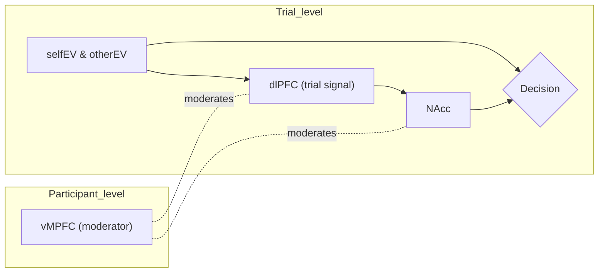

# 🧠 Statistical Modeling of Decision-Making & fMRI

A quick repo for trial-level decision-making with fMRI BOLD signals.  
The pipeline models choices with **hierarchical mixed-effects** and explores a **moderated-mediation** structure via **SEM**.  
This work was completed during my PhD and includes a partially finished paper and accompanying R code.

> 🎯 **Goal:** Explain how expected values (EVs) and prefrontal signals predict choice, with **NAcc** as a mediator and **vMPFC** as a moderator, accounting for participant/run nesting.

---

## 🔍 TL;DR (what’s in here)

- 🧪 **Behavior:** trial-level **`Decision`** from EVs + neural predictors (e.g., dlPFC / vMPFC), with participants (`ptp`) and runs (`Run`) as grouping factors.  
- 🧩 **Mediator:** **`NAcc`** predicted from the same inputs.  
- 🧱 **SEM layer:** **lavaan** tests (moderated) mediation using centered variables and interaction terms.  
- 📄 **Paper:** the PDF documents the design and rationale.

---

## 🗺️ Quick Picture (conceptual)



> ℹ️ **Interpretation:** EVs and dlPFC influence **NAcc**, which in turn influences **Decision**.  
> vMPFC moderates key links (e.g., EVs×dlPFC → NAcc; NAcc → Decision in the SEM).  
> Mixed effects handle repeated trials within participant/run.

---

## 📂 Repository Contents

```
.
├── analysis.R
├── write_up.pdf
└── README.md
```

---

## 🧭 Model Outline (informal)

- **Behavioral model (GLMM, binomial)**  
  `Decision ~ (selfEV + otherEV) × dlPFC_trial × (vMPFC_self + vMPFC_other) + (1 + slopes | ptp/Run)`

- **Mediator model (LMM, gaussian)**  
  `NAcc ~ (selfEV + otherEV) × dlPFC_trial × (vMPFC_self + vMPFC_other) + (1 + slopes | ptp/Run)`

- **SEM (lavaan)**  
  Moderated mediation with mean-centered main effects and **explicit product terms** (no latent variables).  
  Bootstrap is used for inference on indirect effects.

---

## 📝 Citing / Acknowledgements

If you use this code or text, please cite the accompanying paper and this repository.  
Authored by **Anthony Romyn** & **Dr. Wil Cunningham**.

---

## 🗂 Data & Paths

**Data are not included in the repo.**
